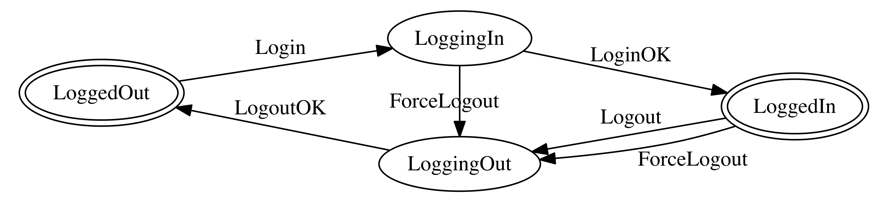

# 🌾 Harvest

[](https://swift.org/download/)
[](https://travis-ci.org/inamiy/Harvest)

Apple's [Combine.framework](https://developer.apple.com/documentation/combine) (from iOS 13) + State Machine, inspired by [Redux](https://github.com/reactjs/redux) and [Elm](http://elm-lang.org/).

This is a sister library of the following projects:

- [ReactiveAutomaton](https://github.com/inamiy/ReactiveAutomaton) (using [ReactiveSwift](https://github.com/ReactiveCocoa/ReactiveSwift))
- [RxAutomaton](https://github.com/inamiy/RxAutomaton) (using [RxSwift](https://github.com/ReactiveX/RxSwift))

## Requirement

Xcode 11 (Swift 5.1 / macOS 10.15, iOS 13, ...)

## Example



To make a state transition diagram like above _with additional effects_, follow these steps:

### 1. Define `State`s and `Input`s

```swift
// 1. Define `State`s and `Input`s.
enum State {
    case loggedOut, loggingIn, loggedIn, loggingOut
}

enum Input {
    case login, loginOK, logout, logoutOK
    case forceLogout
}
```

### 2. Define `EffectQueue`

```swift
enum EffectQueue: EffectQueueProtocol {
    case `default`
    case request

    var flattenStrategy: FlattenStrategy {
        switch self {
        case .default: return .merge
        case .request: return .latest
        }
    }

    static var defaultEffectQueue: EffectQueue {
        .default
    }
}
```

`EffectQueue` allows additional side-effects (`Effect`, a wrapper of `Publisher`) to be scheduled with a specific `FlattenStrategy`, such as `flatMap` (`.merge`), `flatMapLatest` (`.latest`), etc.
In above case, we want to automatically cancel previous network requests if occurred multiple times, so we also prepare `case request` queue with `.latest` strategy.

### 3. Create `EffectMapping` (Effect-wise reducer)

```swift
// NOTE: `EffectID` is useful for manual effect cancellation, but not used in this example.
typealias EffectID = Never

typealias Harvester = Harvest.Harvester<Input, State>
typealias EffectMapping = Harvester.EffectMapping<EffectQueue, EffectID>
typealias Effect = Harvester.Effect<Input, EffectQueue, EffectID>

// Additional effects while state-transitioning.
let loginOKPublisher = /* show UI, setup DB, request APIs, ..., and send `Input.loginOK` */
let logoutOKPublisher = /* show UI, clear cache, cancel APIs, ..., and send `Input.logoutOK` */
let forceLogoutOKPublisher = /* do something more special, ..., and send `Input.logoutOK` */

let canForceLogout: (State) -> Bool = [.loggingIn, .loggedIn].contains

let mappings: [EffectMapping] = [

  /*  Input   |   fromState => toState     |      Effect       */
  /* ----------------------------------------------------------*/
    .login    | .loggedOut  => .loggingIn  | Effect(loginOKPublisher, queue: .request),
    .loginOK  | .loggingIn  => .loggedIn   | nil,
    .logout   | .loggedIn   => .loggingOut | Effect(logoutOKPublisher, queue: .request),
    .logoutOK | .loggingOut => .loggedOut  | nil,

    .forceLogout | canForceLogout => .loggingOut | Effect(forceLogoutOKPublisher, queue: .request)
]
```

`EffectMapping` is Redux's `Reducer` or Elm's `Update` pure function that also returns `Effect` during the state-transition.
Note that `queue: .request` is specified so that those effects will be handled in the same queue with `.latest` strategy.
Instead of writing it as a plain function with pattern-matching, you can also write in a fancy markdown-table-like syntax as shown above.

### 4. Setup `Harvester` (state machine)

```swift
// Prepare input pipe for sending `Input` to `Harvester`.
let inputs = PassthroughSubject<Input, Never>()

var cancellables: [AnyCancellable] = []

// Setup state machine.
let harvester = Harvester(
    state: .loggedOut,
    input: inputs,
    mapping: .reduce(mappings),  // combine mappings using `reduce` helper
)

// Observe state-transition replies (`.success` or `.failure`).
harvester.replies.sink { reply in
    print("received reply = \(reply)")
}.store(in: &cancellables)

// Observe current state changes.
harvester.state.sink { state in
    print("current state = \(state)")
}.store(in: &cancellables)
```

NOTE: `func reduce` is declared to combine multiple `mappings` into one.

### 5. And let's test!

```swift
let send = inputs.send

expect(harvester.state) == .loggedIn    // already logged in
send(Input.logout)
expect(harvester.state) == .loggingOut  // logging out...
// `logoutOKPublisher` will automatically send `Input.logoutOK` later
// and transit to `State.loggedOut`.

expect(harvester.state) == .loggedOut   // already logged out
send(Input.login)
expect(harvester.state) == .loggingIn   // logging in...
// `loginOKPublisher` will automatically send `Input.loginOK` later
// and transit to `State.loggedIn`.

// 👨🏽 < But wait, there's more!
// Let's send `Input.forceLogout` immediately after `State.loggingIn`.

send(Input.forceLogout)                       // 💥💣💥
expect(harvester.state) == .loggingOut  // logging out...
// `forceLogoutOKublisher` will automatically send `Input.logoutOK` later
// and transit to `State.loggedOut`.
```

Please notice how state-transitions, effect calls and cancellation are nicely performed.
If your cancellation strategy is more complex than just using `FlattenStrategy.latest`, you can also use `Effect.cancel` to manually stop specific `EffectID`.

Note that **any sizes of `State` and `Input` will work using `Harvester`**, from single state (like above example) to covering whole app's states (like React.js + Redux architecture).

## Using `Feedback` effect model as alternative

Instead of using `EffectMapping` with fine-grained `EffectQueue` model, Harvest also supports `Feedback` system as described in the following libraries:

- [NoTests/RxFeedback](https://github.com/NoTests/RxFeedback.swift)
- [Babylonpartners/ReactiveFeedback](https://github.com/Babylonpartners/ReactiveFeedback)
- [sergdort/CombineFeedback](https://github.com/sergdort/CombineFeedback)

See [inamiy/ReactiveAutomaton#12](https://github.com/inamiy/ReactiveAutomaton/pull/12) for more discussion.

## References

1. [ReactiveAutomaton](https://github.com/inamiy/ReactiveAutomaton) (using [ReactiveSwift](https://github.com/ReactiveCocoa/ReactiveSwift))
1. [RxAutomaton](https://github.com/inamiy/RxAutomaton) (using [RxSwift](https://github.com/ReactiveX/RxSwift))
1. [iOSDC 2016 (Tokyo, in Japanese)](https://iosdc.jp/2016/) (2016/08/20)
    - [iOSDC Japan 2016 08/20 Track A / Reactive State Machine / 稲見 泰宏 - YouTube](https://www.youtube.com/watch?v=Yvz9H9AWGFM) (video)
    - [Reactive State Machine (Japanese) // Speaker Deck](https://speakerdeck.com/inamiy/reactive-state-machine-japanese) (slide)
1. [iOSConf SG (Singapore, in English)](http://iosconf.sg/) (2016/10/20-21)
    - [Reactive State Machine - iOS Conf SG 2016 - YouTube](https://www.youtube.com/watch?v=Oau4JjJP3nA) (video)
    - [Reactive State Machine // Speaker Deck](https://speakerdeck.com/inamiy/reactive-state-machine-1) (slide)

## License

[MIT](LICENSE)
